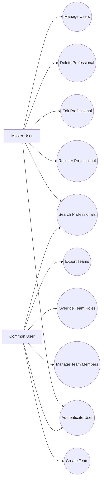

# Use Case Diagram

```mermaid
graph LR

MasterUser[Master User]
CommonUser[Common User]

Authenticate((Authenticate User))
RegisterProfessional((Register Professional))
EditProfessional((Edit Professional))
DeleteProfessional((Delete Professional))
SearchProfessional((Search Professionals))
CreateTeam((Create Team))
ManageTeam((Manage Team Members))
OverrideRoles((Override Team Roles))
ExportTeams((Export Teams))
ManageUsers((Manage Users))

MasterUser --> Authenticate
MasterUser --> RegisterProfessional
MasterUser --> EditProfessional
MasterUser --> DeleteProfessional
MasterUser --> SearchProfessional
MasterUser --> ManageUsers

CommonUser --> Authenticate
CommonUser --> SearchProfessional
CommonUser --> CreateTeam
CommonUser --> ManageTeam
CommonUser --> OverrideRoles
CommonUser --> ExportTeams
```