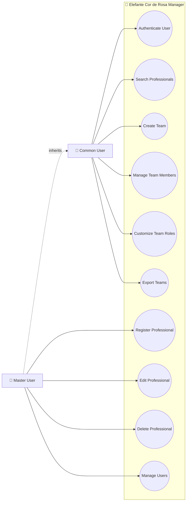

# Use Case Diagram

```mermaid
graph LR

%% Actors
CommonUser["👤 Common User"]
MasterUser["👑 Master User"]

%% Inheritance
MasterUser -. inherits .-> CommonUser

%% System Boundary
subgraph System["🐘 Elefante Cor de Rosa Manager"]

Authenticate(("Authenticate User"))

SearchProfessional(("Search Professionals"))

RegisterProfessional(("Register Professional"))
EditProfessional(("Edit Professional"))
DeleteProfessional(("Delete Professional"))

CreateTeam(("Create Team"))
ManageTeam(("Manage Team Members"))
CustomizeRoles(("Customize Team Roles"))

ExportTeams(("Export Teams"))

ManageUsers(("Manage Users"))

end

%% Common User Permissions
CommonUser --> Authenticate
CommonUser --> SearchProfessional
CommonUser --> CreateTeam
CommonUser --> ManageTeam
CommonUser --> CustomizeRoles
CommonUser --> ExportTeams

%% Master User Exclusive Permissions
MasterUser --> RegisterProfessional
MasterUser --> EditProfessional
MasterUser --> DeleteProfessional
MasterUser --> ManageUsers
```